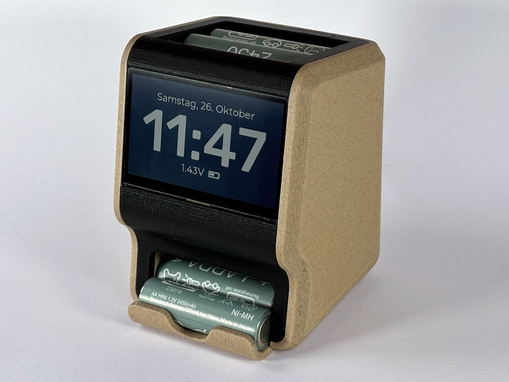
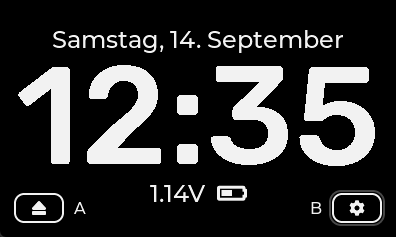

# SPINC - DIY Automatic Battery Charger

## Overview

SPINC is an Open-Source NiMH charging station that can automatically load and eject AA battery cells. Simply drop batteries into the top of the device, regardless of their polarity. The internal mechanism picks up one cell at a time and fast-charges them sequentially. Up to 7 fully charged batteries can be conveniently stored inside the device for easy access. In addition, SPINC doubles as a desk clock, displaying the date and time on its high-resolution LCD.

  

### Features
* 2.8” 320x240px capacitive touchscreen
* Fast-charges AA NiMH cells at up to 1A
* Automatic cell loading and ejection
* Electronic polarity-correction
* Voltage, temperature and charge time monitoring
* 240x400px monochrome LCD
* Date and time display using LVGL interface
* Compact and fully 3D-printed